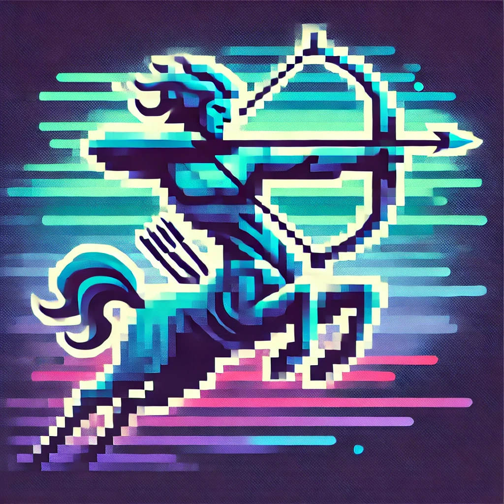

# Sagittar

    

A free UCI Chess engine

# Building Sagittar

See [BUILDING.md](BUILDING.md) for instructions on how to build Sagittar from source and a list of supported platforms.

# Acknowledgements

- https://www.chessprogramming.org for concepts
- https://github.com/bluefeversoft/vice for concepts and code snippets
- https://github.com/maksimKorzh/bbc for concepts and code snippets
- https://github.com/AndyGrant/Ethereal for perft standard.epd file, tuner concepts, and code snippets
- https://github.com/TerjeKir/EngineTests for mate .epd files
- https://github.com/kz04px/libchess for perft test cases
- https://github.com/kz04px/rawr for perft test cases
- https://github.com/GediminasMasaitis/texel-tuner for tuner concepts and code snippets
- https://github.com/TerjeKir/weiss for tuner code snippets
- https://github.com/KierenP/ChessTrainingSets for training dataset
- [Engine Programming Discord](https://discord.com/invite/F6W6mMsTGN) for support and guidance on development
- [OpenBench Discord](https://discord.com/invite/9MVg7fBTpM) for support and guidance on OpenBench
